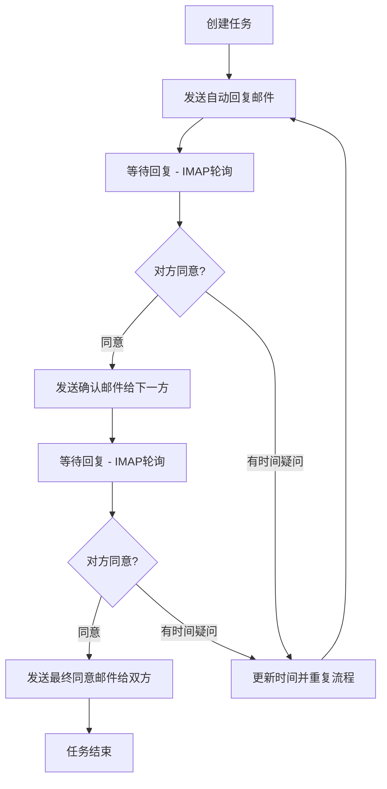

# Langgraph4j Example

## 项目概述

这是一个基于 langgraph 的流程编排项目，用于对不同的 React Agent 进行协调管理，实现了一个自动邮件沟通的机器人系统。

## 核心功能

项目实现一个自动邮件沟通的机器人角色，

角色: 

- 自动回复机器人
- 拖车公司
- 仓库

业务流程:

1. 创建一个任务(时间&地点), 
2. 自动回复机器人会按照模板要求自动发送给仓库或者拖车公司(可配置谁在前)
3. 等待对方回复(采用imap进行轮训查询)
4. 同意后,给仓库或者拖车公司(配置的在后面的)发送邮件确认
5. 等待对方回复(采用imap进行轮训查询)
6. 对方如果对于时间有疑问, 将对方给出的时间去处, 重复从第二条流程开始
7. 对方如果也回复同意, 给双方发送最终同意的邮件
8. 结束

## 流程图



## 技术栈

- **Spring Boot**: 3.5.5
- **langgraph4j**: 1.7.0
- **Java**: 21+
- **Maven**: 构建工具

## 项目结构

```
langgraph_example/
├── src/
│   └── io/
│       └── eeaters/
│           └── langgraph/
│               └── example/
│                   ├── Main.java                 # jbang入口文件
│                   ├── workflow/
│                   │   ├── TaskWorkflow.java     # 主工作流定义
│                   │   └── nodes/
│                   │       ├── CreateTaskNode.java
│                   │       ├── SendAutoReplyNode.java
│                   │       ├── WaitForReplyNode.java
│                   │       ├── SendConfirmationNode.java
│                   │       └── SendFinalAgreementNode.java
│                   ├── model/
│                   │   ├── Task.java
│                   │   ├── TaskStatus.java
│                   │   ├── Party.java
│                   │   └── EmailResponse.java
│                   ├── service/
│                   │   ├── EmailService.java
│                   │   ├── TaskService.java
│                   │   └── ConfigService.java
│                   ├── config/
│                   │   ├── WorkflowConfig.java
│                   │   └── EmailConfig.java
│                   └── util/
│                       └── EmailTemplate.java
├── resources/
│   ├── application.properties
│   └── email-templates/
│       ├── auto-reply-template.txt
│       ├── confirmation-template.txt
│       └── final-agreement-template.txt
├── jbang-catalog.java
└── README.md
```

## 构建和开发命令

### 基础命令

```bash
# 编译所有模块
./mvnw clean compile

# 运行单元测试
./mvnw clean test

# 运行完整构建（包括集成测试）
./mvnw clean verify

# 安装构件到本地仓库
./mvnw clean install

# 运行示例应用
./mvnw spring-boot:run
```

### 代码质量

- 代码格式化通过 `spring-javaformat-maven-plugin` 强制执行
- 格式化验证在 `validate` 阶段运行
- 使用 Spring 的 Java 代码格式化约定

## 重要：提交前必须格式化代码

**在每次提交前务必运行 `./mvnw spring-javaformat:apply`**

- 如果发现格式化违规，CI 将会失败
- 永远不要提交未格式化的代码 - 这会破坏其他所有人的构建
- 格式化违规是不可接受的，必须避免

## 开发规范

### 实体类设计规范

1. **使用 Lombok**: 所有实体类使用 Lombok 注解简化代码，避免手写 getter/setter 方法
2. **@Data 注解**: 使用 `@Data` 自动生成 getter、setter、toString、equals、hashCode 方法
3. **@Builder 注解**: 使用 `@Builder` 提供建造者模式支持
4. **@AllArgsConstructor 和 @NoArgsConstructor**: 提供完整的构造函数
5. **字段访问**: 直接使用字段名访问，通过 Lombok 自动生成的 getter/setter

示例:
```java
// 推荐: 使用 Lombok
@Data
@Builder
@NoArgsConstructor
@AllArgsConstructor
public class Task {
    private String id;
    private String title;
    private LocalDateTime scheduledTime;
    private String location;
    private TaskStatus status;
    private Party currentParty;
}
```

### 编码要求

- **禁止手写 getter/setter**: 使用 Lombok 注解自动生成
- **使用 @Builder**: 复杂对象创建使用建造者模式
- **链式调用**: 支持流畅的 API 调用方式

### langgraph示例

```java

public class EmailGraph {

    private static final String STEP = "currentStep";

    // 首轮和拖车公司沟通阶段
    private static final String TRAILER = "trailer";

    // 和仓库沟通阶段
    private static final String WAREHOUSE = "warehouse";


    public static class EmailState extends AgentState {
        public EmailState(Map<String,Object> data) {
            super(data);
        }
        public String currentStep() {
            return this.<String>value(STEP).orElse("");
        }
    }

    public static final Map<String, Channel<?>> SCHEMA = Map.of(
            "truckCompanyReply", Channels.base(() -> ""),
            "warehouseReply", Channels.base(() -> ""),
            "currentStep", Channels.base(() -> ""),
            "terminated", Channels.base(() -> false)
    );


    NodeAction<EmailState> contract_trailer_company = state -> {
        System.out.println("发送邮件");
        return Map.of(STEP, TRAILER);
    };

    NodeAction<EmailState> doLoopEmail = state -> {
        System.out.println("轮训邮箱");
        return Map.of(STEP, TRAILER);
    };

    NodeAction<EmailState> parseEmail = emailState -> {
        System.out.println("解析邮件内容, 确认回复情况");
        return Map.of(STEP, TRAILER);
    };

    NodeAction<EmailState> pending = emailState -> {
        System.out.println("todo");
        return Map.of(STEP, TRAILER);
    };

    EdgeAction<EmailState> trailerReplyEdge = emailState -> {
        //查询邮箱
        if (emailState.currentStep().equals(TRAILER)) {
            //确认最新的邮件是来自拖车公司的邮件
            return "parseEmail";
        }
//        else if (emailState.currentStep().equals(STEP)) {
//            //确认最新的额邮件是来自仓库的邮件
//        }
        return "doLoopEmail";
    };

    @Test
    public void test() throws GraphStateException {
        var emailStateStateGraph = new StateGraph<EmailState>(SCHEMA, EmailState::new)
                .addNode("contract_trailer_company", node_async(contract_trailer_company))
                .addNode("doLoop", node_async(doLoopEmail))
                .addNode("parseEmail", node_async(parseEmail))
                .addNode("pending", node_async(pending))
                .addEdge(START, "contract_trailer_company")
                .addEdge("contract_trailer_company", "doLoop")
                .addEdge("parseEmail", "pending")
                .addEdge("pending", END);

        emailStateStateGraph.addConditionalEdges("doLoop",
                AsyncCommandAction.of(edge_async(emailState -> {
                    if (emailState.currentStep().equals(TRAILER)) {
                        return "parseEmail";
                    }
                    return "doLoop";
                }))
                , Map.of("parseEmail", "parseEmail", WAREHOUSE, "doLoop")
        );
        CompileConfig config = CompileConfig.builder()
                .checkpointSaver(new MemorySaver())
                .interruptAfter("doLoop")
                .releaseThread(true)
                .build();

        CompiledGraph<EmailState> compile = emailStateStateGraph.compile(config);
        GraphRepresentation graph = compile.getGraph(GraphRepresentation.Type.MERMAID);
        System.out.println(graph.content());


        Optional<EmailState> invoke = compile.invoke(Map.of());
        invoke.ifPresent(System.out::println);

    }

}
```


## 运行环境要求

- Java 21+
- Maven 3.6+
- Spring Boot 3.5.5

## 日志配置

使用 `logback-spring.xml` 进行日志配置，支持不同环境的日志级别设置。