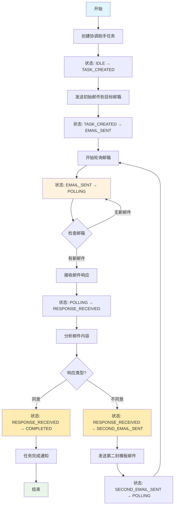

# Email Coordinator State Machine Project

## 项目概述

这是一个基于 Spring State Machine 的流程编排项目，用于对不同的 React Agent 进行协调管理，实现类似 LangGraph 的效果。该项目实现了一个自动邮件沟通的机器人系统。

## 核心功能

项目实现一个自动邮件沟通的机器人角色，包含以下工作流程：

1. **创建协调助手任务** - 初始化邮件协调任务
2. **发送初始邮件** - 向任务约定的邮箱发送邮件
3. **轮询邮箱** - 持续监控邮箱等待回复
4. **处理同意邮件** - 收到同意邮件后结束任务
5. **处理非同意邮件** - 收到非同意邮件时发送第二封模板邮件
6. **循环处理** - 重复步骤 3-4-5 直到获得同意响应

## 工作流程图



## 技术栈

- **Spring Boot**: 3.5.5
- **Spring State Machine**: 适配 Spring Boot 3.5.5 版本
- **Java**: 17+
- **Maven**: 构建工具

## 项目结构

```
email-coordinator/
├── src/
│   ├── main/
│   │   ├── java/
│   │   │   └── io/
│   │   │       └── eeaters/
│   │   │           └── statemachine/
│   │   │               ├── EmailCoordinatorApplication.java    # 主启动类
│   │   │               ├── config/                             # 配置类
│   │   │               │   ├── StateMachineConfig.java         # 状态机配置
│   │   │               │   └── EmailConfig.java               # 邮件配置
│   │   │               ├── model/                              # 数据模型
│   │   │               │   ├── EmailTask.java                 # 邮件任务模型
│   │   │               │   ├── EmailResponse.java             # 邮件响应模型
│   │   │               │   └── CoordinatorContext.java        # 协调器上下文
│   │   │               ├── state/                              # 状态机相关
│   │   │               │   ├── States.java                    # 状态定义
│   │   │               │   ├── Events.java                    # 事件定义
│   │   │               │   ├── StateMachineService.java       # 状态机服务
│   │   │               │   └── actions/                       # 状态动作
│   │   │               │       ├── CreateTaskAction.java      # 创建任务动作
│   │   │               │       ├── SendEmailAction.java       # 发送邮件动作
│   │   │               │       ├── PollEmailAction.java       # 轮询邮件动作
│   │   │               │       ├── ProcessResponseAction.java  # 处理响应动作
│   │   │               │       └── CompleteTaskAction.java    # 完成任务动作
│   │   │               ├── service/                            # 业务服务
│   │   │               │   ├── EmailService.java              # 邮件服务
│   │   │               │   └── TaskService.java               # 任务服务
│   │   │               └── agent/                              # AI 代理
│   │   │                   ├── CoordinatorAgent.java          # 协调代理
│   │   │                   └── ResponseAnalyzerAgent.java     # 响应分析代理
│   │   └── resources/
│   │       ├── application.yml                                # 应用配置
│   │       └── logback-spring.xml                             # 日志配置
│   └── test/
│       └── java/
│           └── io/
│               └── eeaters/
│                   └── statemachine/                          # 测试代码
├── pom.xml                                                     # Maven 配置
└── README.md                                                   # 项目说明
```

## Spring State Machine 实现机制

使用 Spring Statemachine 通过 **Guard + Choice** 的组合来实现类似 LangGraph 的 conditionEdge 功能：

### Guard: 条件判断逻辑
- **作用**: 在状态转换前提供条件判断
- **实现**: 通过 `Guard<S, E>` 接口实现条件逻辑
- **应用场景**:
  - 判断邮件响应类型（同意/不同意）
  - 验证任务执行前置条件
  - 检查邮箱状态

### Choice: 多路分支路由
- **作用**: 根据条件结果选择不同的状态转换路径
- **实现**: 配置 `ChoiceState` 和多个转换条件
- **应用场景**:
  - 根据邮件响应内容选择不同处理流程
  - 基于业务规则路由到不同状态
  - 动态决策状态流转方向

### Extended State: 状态机上下文数据传递
- **作用**: 在状态机上下文中存储和传递业务数据
- **实现**: 使用 `StateMachineContext.getExtendedState()`
- **存储内容**:
  - 当前邮件任务信息 (`EmailTask`)
  - 邮件响应数据 (`EmailResponse`)
  - 协调器上下文 (`CoordinatorContext`)
  - 业务决策变量和中间结果

这种设计模式实现了状态驱动的业务流程编排，通过状态机的事件驱动机制，能够灵活处理复杂的业务逻辑和条件分支，达到类似 LangGraph 中条件边（conditionEdge）的效果。

## 状态机设计

### 状态定义 (States)

- `IDLE` - 空闲状态
- `TASK_CREATED` - 任务已创建
- `EMAIL_SENT` - 邮件已发送
- `POLLING` - 轮询邮箱中
- `RESPONSE_RECEIVED` - 收到响应
- `SECOND_EMAIL_SENT` - 第二封邮件已发送
- `COMPLETED` - 任务完成

### 事件定义 (Events)

- `CREATE_TASK` - 创建任务
- `SEND_EMAIL` - 发送邮件
- `START_POLLING` - 开始轮询
- `RECEIVE_RESPONSE` - 接收响应
- `SEND_SECOND_EMAIL` - 发送第二封邮件
- `COMPLETE_TASK` - 完成任务
- `RESPONSE_AGREE` - 同意响应
- `RESPONSE_DISAGREE` - 不同意响应

## 构建和开发命令

### 基础命令

```bash
# 编译所有模块
./mvnw clean compile

# 运行单元测试
./mvnw clean test

# 运行完整构建（包括集成测试）
./mvnw clean verify

# 安装构件到本地仓库
./mvnw clean install

# 运行示例应用
./mvnw spring-boot:run
```

### 代码质量

- 代码格式化通过 `spring-javaformat-maven-plugin` 强制执行
- 格式化验证在 `validate` 阶段运行
- 使用 Spring 的 Java 代码格式化约定

## 重要：提交前必须格式化代码

**在每次提交前务必运行 `./mvnw spring-javaformat:apply`**

- 如果发现格式化违规，CI 将会失败
- 永远不要提交未格式化的代码 - 这会破坏其他所有人的构建
- 格式化违规是不可接受的，必须避免

## 开发指南

### 添加新状态

1. 在 `States.java` 中定义新状态
2. 在 `StateMachineConfig.java` 中配置状态转换
3. 如需要，在 `actions/` 包下创建对应的动作类
4. 更新 `CoordinatorContext.java` 添加新的上下文字段

### 添加新事件

1. 在 `Events.java` 中定义新事件
2. 在 `StateMachineConfig.java` 中配置事件触发的状态转换
3. 在相应的服务类中触发事件

### 扩展邮件代理

1. 修改 `ResponseAnalyzerAgent.java` 添加新的响应分析逻辑
2. 更新 `EmailService.java` 支持新的邮件模板
3. 在 `ProcessResponseAction.java` 中处理新的响应类型

## 运行环境要求

- Java 17+
- Maven 3.6+
- Spring Boot 3.5.5

## 配置说明

主要配置文件：

- `application.yml` - 应用主配置，包括数据库、邮件服务器等配置
- `StateMachineConfig.java` - 状态机配置，定义状态、事件和转换规则
- `EmailConfig.java` - 邮件服务配置

## 日志配置

使用 `logback-spring.xml` 进行日志配置，支持不同环境的日志级别设置。