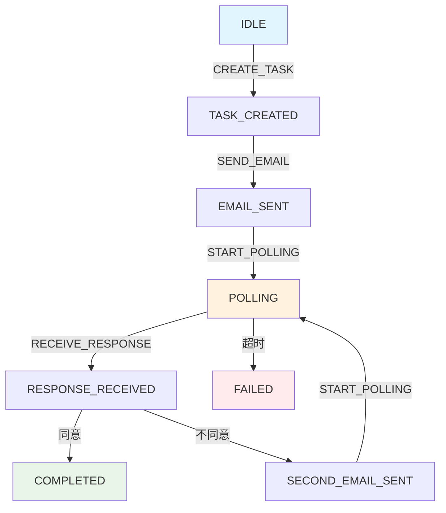

# Email Coordinator State Machine Example

基于 Spring State Machine 的邮件协调机器人系统，实现类似 LangGraph 的条件边（conditionEdge）功能。

## 🎯 项目简介

本项目实现了一个自动邮件沟通的机器人角色，通过状态机管理邮件协调任务的生命周期：

1. **创建协调助手任务** - 初始化邮件协调任务
2. **发送初始邮件** - 向目标邮箱发送邀请邮件
3. **轮询邮箱** - 持续监控邮箱等待回复
4. **处理同意邮件** - 收到同意回复后完成任务
5. **处理非同意邮件** - 发送第二封模板邮件，继续轮询
6. **循环处理** - 重复步骤 3-4-5 直到获得明确回复

## 🏗️ 技术架构

### 核心技术栈

- **Spring Boot 3.5.5** - 应用框架
- **Spring State Machine 4.0.0** - 状态机引擎
- **Spring AI** - AI代理能力
- **JavaMail** - 邮件服务
- **Lombok** - 代码简化

### 设计模式

本项目通过 **Guard + Choice + Extended State** 的组合实现类似 LangGraph 的条件边功能：

- **Guard**: 提供条件判断逻辑，控制状态转换
- **Choice**: 提供多路分支路由，根据Guard结果选择路径
- **Extended State**: 在状态机上下文中传递数据，维护业务状态

## 📁 项目结构

```
email-coordinator/
├── src/
│   ├── main/
│   │   ├── java/io/eeaters/statemachine/
│   │   │   ├── EmailCoordinatorApplication.java    # 主启动类
│   │   │   ├── config/                             # 配置类
│   │   │   │   ├── StateMachineConfig.java         # 状态机配置
│   │   │   │   └── EmailConfig.java               # 邮件配置
│   │   │   ├── model/                              # 数据模型
│   │   │   │   ├── EmailTask.java                 # 邮件任务模型
│   │   │   │   ├── EmailResponse.java             # 邮件响应模型
│   │   │   │   └── CoordinatorContext.java        # 协调器上下文
│   │   │   ├── state/                              # 状态机相关
│   │   │   │   ├── States.java                    # 状态定义
│   │   │   │   ├── Events.java                    # 事件定义
│   │   │   │   ├── StateMachineService.java       # 状态机服务
│   │   │   │   └── actions/                       # 状态动作
│   │   │   │       ├── CreateTaskAction.java
│   │   │   │       ├── SendEmailAction.java
│   │   │   │       ├── PollEmailAction.java
│   │   │   │       ├── ProcessResponseAction.java
│   │   │   │       └── CompleteTaskAction.java
│   │   │   ├── service/                            # 业务服务
│   │   │   │   ├── EmailService.java              # 邮件服务
│   │   │   │   └── TaskService.java               # 任务服务
│   │   │   ├── agent/                              # AI 代理
│   │   │   │   ├── CoordinatorAgent.java          # 协调代理
│   │   │   │   └── ResponseAnalyzerAgent.java     # 响应分析代理
│   │   │   └── controller/                         # REST API
│   │   │       └── EmailCoordinatorController.java
│   │   └── resources/
│   │       ├── application.yml                     # 应用配置
│   │       └── logback-spring.xml                  # 日志配置
│   └── test/                                       # 测试代码
└── README.md
```

## 🚀 快速开始

### 环境要求

- Java 21+
- Maven 3.6+
- Spring Boot 3.5.5

### 1. 克隆项目

```bash
git clone <repository-url>
cd my-spring-ai-example/state-machine-example
```

### 2. 配置邮件服务

修改 `src/main/resources/application.yml` 中的邮件配置：

```yaml
spring:
  mail:
    host: smtp.gmail.com
    port: 587
    username: your-email@gmail.com
    password: your-app-password
```

### 3. 配置AI服务（可选）

如果需要使用AI分析邮件响应，配置OpenAI API：

```yaml
spring:
  ai:
    openai:
      api-key: your-openai-api-key
```

### 4. 运行应用

```bash
./mvnw spring-boot:run
```

### 5. 使用API

创建邮件协调任务：

```bash
curl -X POST http://localhost:8080/api/email-coordinator/tasks \
  -H "Content-Type: application/json" \
  -d '{
    "taskId": "task-001",
    "title": "项目协调会议",
    "description": "邀请参加项目协调会议",
    "targetEmail": "colleague@example.com",
    "subject": "项目协调会议邀请",
    "body": "您好，诚邀您参加项目协调会议..."
  }'
```

查询任务状态：

```bash
curl http://localhost:8080/api/email-coordinator/tasks/task-001/status
```

## 🔄 状态机流程图



## 🔧 API 文档

### 任务管理

| 方法 | 路径 | 描述 |
|------|------|------|
| POST | `/api/email-coordinator/tasks` | 创建邮件协调任务 |
| GET | `/api/email-coordinator/tasks/{id}/status` | 查询任务状态 |
| GET | `/api/email-coordinator/tasks/active` | 获取所有活跃任务 |
| POST | `/api/email-coordinator/tasks/{id}/events` | 手动触发事件 |
| POST | `/api/email-coordinator/tasks/{id}/reset` | 重置任务 |
| DELETE | `/api/email-coordinator/tasks/{id}` | 取消任务 |

### 系统监控

| 方法 | 路径 | 描述 |
|------|------|------|
| GET | `/api/email-coordinator/statistics` | 获取系统统计信息 |
| GET | `/api/email-coordinator/health` | 健康检查 |

## 🧪 测试

运行所有测试：

```bash
./mvnw test
```

运行特定测试：

```bash
./mvnw test -Dtest=EmailCoordinatorApplicationTest
```

## 📝 配置说明

### 邮件协调器配置

```yaml
email-coordinator:
  polling:
    enabled: true          # 是否启用轮询
    interval: 30000        # 轮询间隔（毫秒）
    max-attempts: 100      # 最大轮询次数
    initial-delay: 5000    # 初始延迟

  templates:
    initial-email:
      subject: "协调任务邀请"
      body: "邮件内容..."
    follow-up-email:
      subject: "跟进邮件"
      body: "跟进内容..."

  response-analysis:
    agree-keywords: ["同意", "确认", "OK"]
    disagree-keywords: ["不同意", "拒绝", "NO"]
    confidence-threshold: 0.7
    enable-ai-analysis: true

  task:
    timeout: 3600000       # 任务超时时间（毫秒）
    retry-count: 3         # 失败重试次数
```

## 🛠️ 开发指南

### 添加新状态

1. 在 `States.java` 中定义新状态
2. 在 `StateMachineConfig.java` 中配置状态转换
3. 在 `actions/` 包下创建对应的动作类
4. 更新 `CoordinatorContext.java` 添加新字段

### 添加新事件

1. 在 `Events.java` 中定义新事件
2. 在 `StateMachineConfig.java` 中配置事件转换
3. 在相应的服务类中触发事件

### 扩展响应分析

1. 修改 `ResponseAnalyzerAgent.java` 添加新的分析逻辑
2. 更新 `EmailService.java` 支持新的邮件处理
3. 在 `ProcessResponseAction.java` 中处理新的响应类型

## 🔍 监控和日志

### 日志配置

项目使用 Logback 进行日志管理，支持多种日志级别：

- **应用日志**: `logs/email-coordinator.log`
- **状态机日志**: `logs/state-machine.log`
- **邮件日志**: `logs/email.log`

### 监控指标

- 活跃状态机数量
- 任务完成率
- 平均执行时间
- 错误率统计

## 🤝 贡献指南

1. Fork 项目
2. 创建特性分支 (`git checkout -b feature/AmazingFeature`)
3. 提交更改 (`git commit -m 'Add some AmazingFeature'`)
4. 推送到分支 (`git push origin feature/AmazingFeature`)
5. 开启 Pull Request

## 📄 许可证

本项目采用 MIT 许可证 - 查看 [LICENSE](LICENSE) 文件了解详情

## 🆘 故障排除

### 常见问题

1. **邮件发送失败**
   - 检查邮件服务器配置
   - 确认邮箱密码/应用密码正确
   - 检查网络连接

2. **状态机卡住**
   - 查看状态机日志
   - 检查Guard条件是否满足
   - 确认事件是否正确发送

3. **AI分析失败**
   - 检查API密钥配置
   - 确认网络访问权限
   - 查看AI服务状态

### 调试技巧

- 启用DEBUG日志级别查看详细执行流程
- 使用 `/api/email-coordinator/tasks/{id}/status` 查看实时状态
- 检查 `logs/state-machine.log` 了解状态转换详情

## 📚 参考资料

- [Spring State Machine 官方文档](https://spring.io/projects/spring-statemachine)
- [Spring Boot 官方文档](https://spring.io/projects/spring-boot)
- [LangGraph 文档](https://python.langchain.com/docs/langgraph)

---

**注意**: 这是一个示例项目，用于演示 Spring State Machine 的使用。在生产环境中使用时，请确保：
1. 使用安全的密码管理
2. 添加适当的错误处理
3. 实现完整的监控和告警
4. 考虑性能优化和扩展性